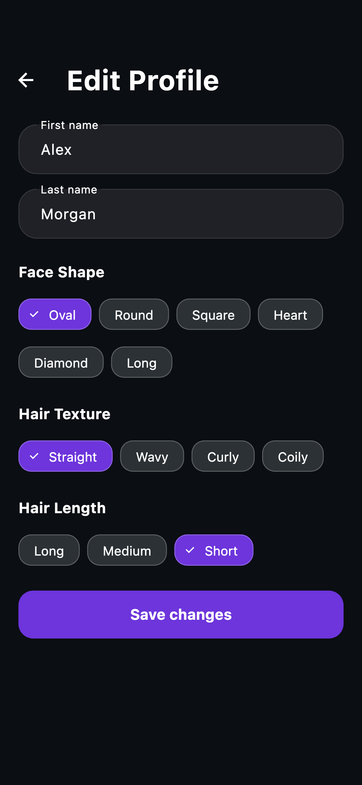
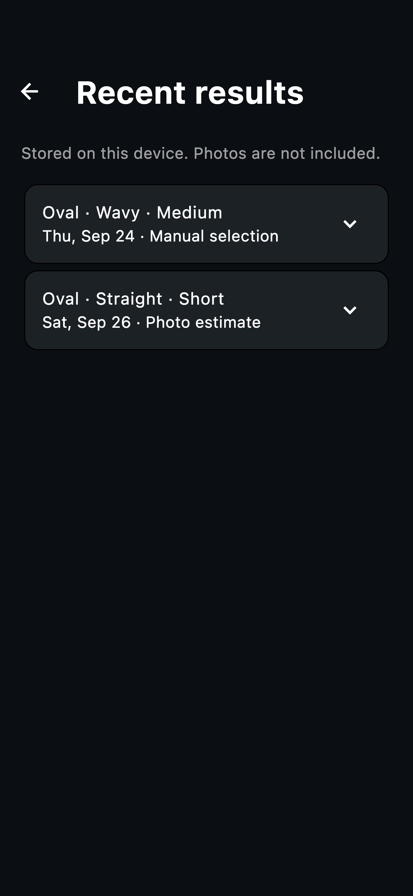
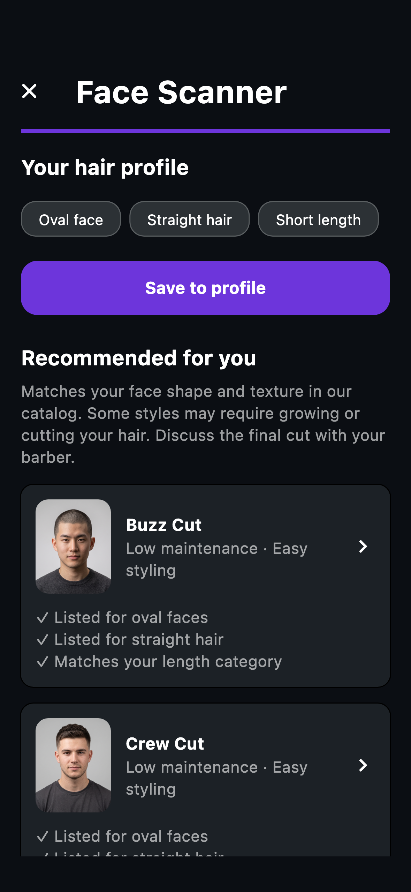

<div align="center">

# Hair App

### Найди стрижку под себя.

Каталог причёсок, анализ формы лица и персональный профиль в одном Flutter-приложении.

**Flutter · Dart · Riverpod · Firebase · iOS & Android**

[Профиль](#профиль) · [Возможности](#возможности) · [Запуск](#запуск) · [Документация](#документация)

</div>

---

## Профиль

Форма лица, текстура и длина волос — основа персональных рекомендаций. Данные можно отредактировать вручную или сохранить после сканирования, а к прошлым результатам вернуться из профиля.

<table>
  <tr>
    <th align="center">Твой профиль</th>
    <th align="center">Настройка параметров</th>
    <th align="center">История результатов</th>
  </tr>
  <tr>
    <td width="33%"></td>
    <td width="33%"></td>
    <td width="33%"></td>
  </tr>
</table>

<details>
<summary><strong>Ещё экраны: главная, каталог и рекомендации</strong></summary>

<table>
  <tr>
    <th align="center">Главная</th>
    <th align="center">Каталог</th>
    <th align="center">Результат сканирования</th>
  </tr>
  <tr>
    <td width="33%"></td>
    <td width="33%"></td>
    <td width="33%"></td>
  </tr>
</table>

</details>

*На изображениях — рендеры Flutter-экранов с демонстрационными данными в тёмной теме. Это не снимки с физического телефона; системная строка состояния отсутствует.*

## Возможности

- **Каталог стрижек.** Поиск, фильтры по форме лица, текстуре и длине волос; карточки с описанием, сложностью укладки и уходом.
- **Face Scanner.** Камера с подсказками положения лица, ручной и автоматический снимок, анализ фото через отдельный локальный сервис и подтверждение результата пользователем.
- **Персональные рекомендации.** Подбор по тегам формы лица и текстуры с ранжированием по длине волос.
- **Профиль.** Редактирование имени и параметров, сохранение результатов сканирования в профиль Firestore.
- **Избранное и история.** Сохраняются на устройстве между запусками, отдельно для гостя и каждого аккаунта.
- **Авторизация.** Email и пароль, Google Sign-In, восстановление пароля через Firebase.
- **Светлая и тёмная темы.** Выбор темы сохраняется на устройстве. Интерфейс приложения — на английском.

### Как устроен подбор

**Снимок → подтверждение формы лица → текстура и длина → рекомендации → сохранение в профиль.**

Сканер можно пройти гостем, а форму лица выбрать вручную. Вход с экрана результата сохраняет текущий выбор, чтобы затем записать его в профиль.

## Запуск

Проверено с **Flutter 3.44.2 / Dart 3.12.2**. Для мобильной сборки нужны Android SDK или macOS с Xcode для iOS.

```sh
git clone https://github.com/kumawy/Hair_app.git
cd Hair_app
flutter pub get
```

Приложение инициализирует Firebase при старте. Для собственного окружения настройте Firebase-проект, включите **Email/Password** в Authentication и создайте **Cloud Firestore** с доступом пользователя к своему профилю. Обновите `lib/firebase_options.dart` и конфигурации платформ для своего проекта. Настройка Google, OAuth-клиентов и отпечатков Android описана в [инструкции по входу](docs/social-sign-in.md).

```sh
flutter devices
flutter run -d <device-id>
```

### Анализ фото

Модель запускается в отдельном Python-сервисе; сервер и веса не входят в этот репозиторий. Приложение ожидает `POST /landmarks` и `POST /predict`, принимающие фото в multipart-поле `photo`.

```sh
flutter run -d <device-id> \
  --dart-define=FACE_ANALYSIS_URL=http://<server-ip>:8000
```

Телефон должен иметь доступ к серверу по сети. В debug-сборке предусмотрен локальный адрес по умолчанию — для своего окружения укажите `FACE_ANALYSIS_URL`. Без сервиса можно использовать ручной выбор параметров. Подробности, запуск локального сервера и проверка камеры — в [документации сканера](docs/face-scanner.md).

## Стек и структура

| Задача | Технология |
| --- | --- |
| Интерфейс и темы | Flutter, Material 3, GLSL shader |
| Состояние и зависимости | Riverpod |
| Навигация | GoRouter |
| Аккаунты и профиль | Firebase Auth, Cloud Firestore, Google Sign-In |
| Избранное, история и настройки | SharedPreferences |
| Камера и анализ | Camera, HTTP, Apple Vision / ML Kit |

```text
lib/
├── core/                 # Навигация, темы и локальное хранилище
├── features/
│   ├── auth/             # Вход, регистрация и восстановление пароля
│   ├── face_scanner/     # Камера, анализ и результаты
│   ├── favorites/        # Избранные стрижки
│   ├── hairstyles/       # Каталог, детали и подбор рекомендаций
│   ├── home/             # Главная
│   ├── profile/          # Профиль, история, настройки и помощь
│   └── search/           # Поиск и фильтры
└── shared/               # Общие модели и виджеты
assets/                   # Каталог и фотографии стрижек
docs/                     # Инструкции и скриншоты
test/                     # Unit- и widget-тесты
tool/                     # Настройка входа и локальный запуск
```

## Проверки

```sh
flutter analyze
flutter test
python3 -m unittest discover -s tool -p 'test_*.py'
```

Тесты охватывают авторизацию, профиль, локальное хранение, каталог, рекомендации и сценарии сканера. Сетевой тест модели запускается отдельно при работающем сервере; обычный `flutter test` его пропускает. Инструкция — в [Face Scanner](docs/face-scanner.md).

## Статус проекта

Финальная версия прототипа. Анализ формы лица даёт предположение, которое пользователь подтверждает; рекомендации основаны на тегах каталога. **Preview hairstyle** показывает референс стрижки из каталога — генерация причёски на фотографии пользователя пока не подключена. История и избранное хранятся локально и не синхронизируются между устройствами. Живую камеру следует проверять на физическом iOS/Android-устройстве.

## Документация

- [Поведение приложения и сценарии ручной проверки](docs/app-demo.md)
- [Face Scanner: сервис, камера и ограничения модели](docs/face-scanner.md)
- [Google Sign-In: настройка и проверка](docs/social-sign-in.md)
