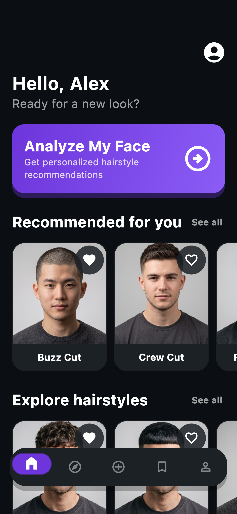
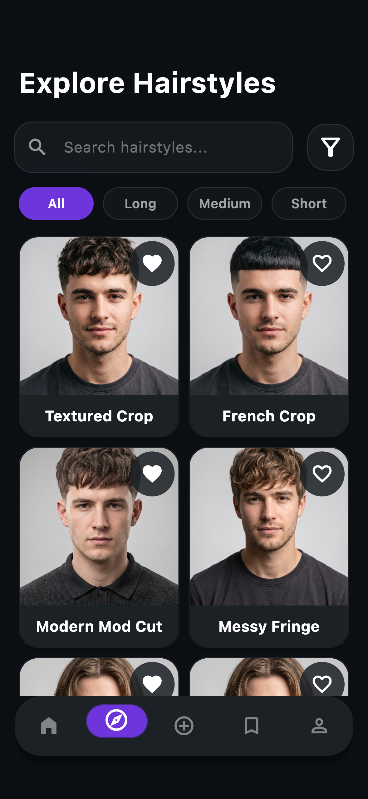
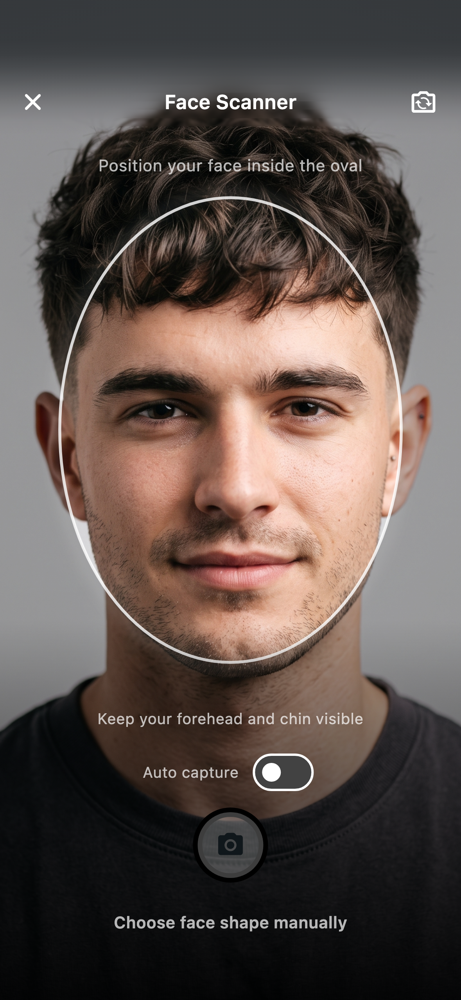
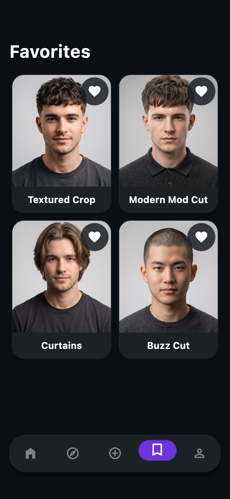
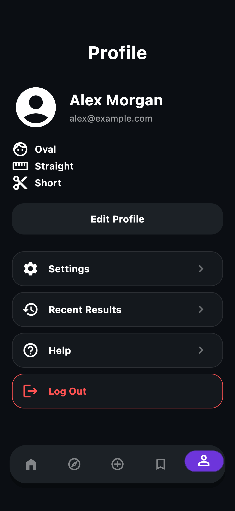
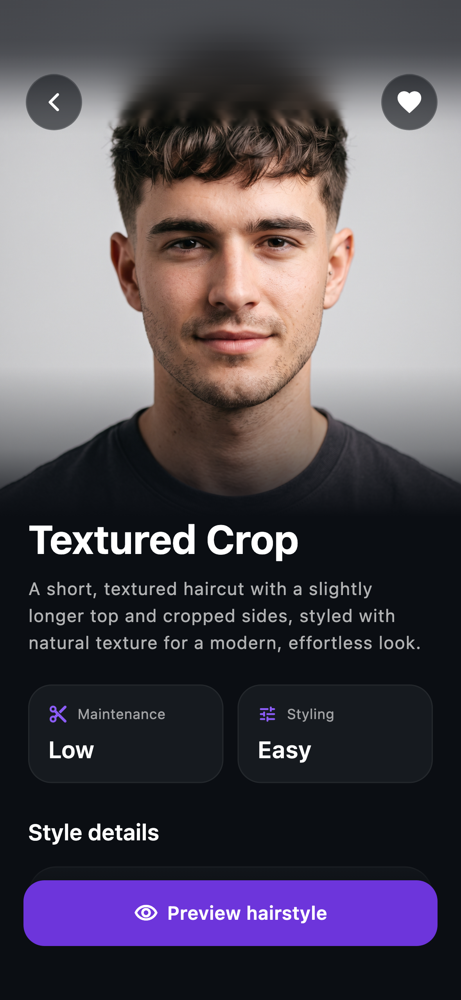

# Hair App

Подбор стрижек, анализ формы лица и персональный профиль.

**Flutter · Firebase · iOS & Android**

<table>
  <tr>
    <th align="center">Главная</th>
    <th align="center">Каталог</th>
    <th align="center">Сканер лица</th>
  </tr>
  <tr>
    <td width="33%"></td>
    <td width="33%"></td>
    <td width="33%"></td>
  </tr>
  <tr>
    <th align="center">Избранное</th>
    <th align="center">Профиль</th>
    <th align="center">Карточка стрижки</th>
  </tr>
  <tr>
    <td width="33%"></td>
    <td width="33%"></td>
    <td width="33%"></td>
  </tr>
</table>

*Рендеры экранов приложения с демонстрационными данными. В камере показано фото из каталога.*
